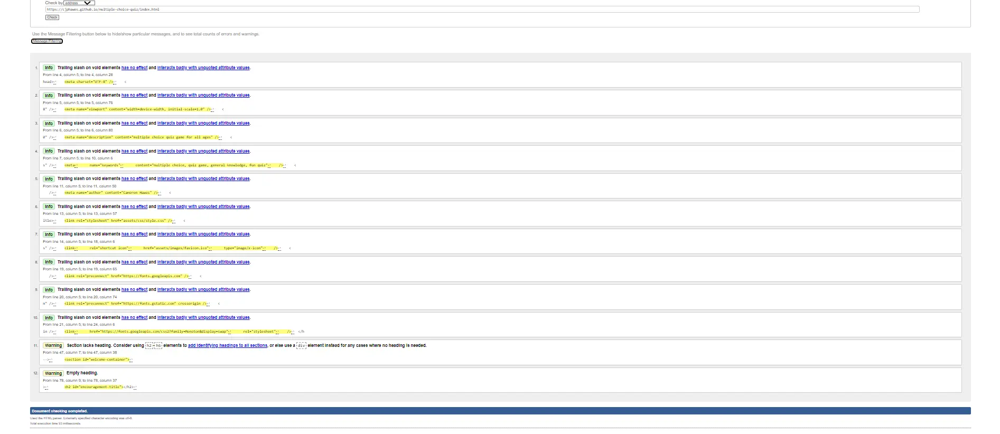
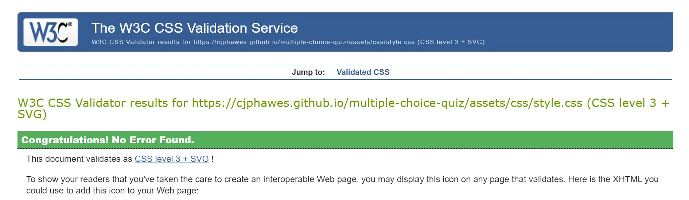

# Testing

#### Compatibility Testing

Testing was completed in Google Chrome, Microsoft Edge and Firefox web browsers.

- Google Chrome

  
  
  
  

- Microsoft Edge
  
  
  
  

- Mozilla Firefox

  
  
  
  

#### Compatibility Issues

Only one issue was found, this was when using an Iphone.

- The button elements text color was displayed as blue and not black unlike on the desktop. This was also further the case when the android phone also displayed black text color and not blue.

#### Validator Testing

##### HTML

- No errors were found using the official [W3C HTML Validator](https://validator.w3.org/nu/?doc=https%3A%2F%2Fcjphawes.github.io%2Fmultiple-choice-quiz%2Findex.html)

##### CSS

- No errors were found using the official [W3C (Jigsaw) Validator](https://jigsaw.w3.org/css-validator/validator?uri=https%3A%2F%2Fcjphawes.github.io%2Fmultiple-choice-quiz%2Fassets%2Fcss%2Fstyle.css&profile=css3svg&usermedium=all&warning=1&vextwarning=&lang=en)

##### Javascript

- No errors were found using the official [JShint Validator](https://jshint.com/)

---

### Accessibility and Performance

- For the users on smaller devices I made sure the Play Button and Restart Buttons had different backgrounds to their counterparts on the desktop devices due to not being able to hover with a cursor.

This is the **Desktop Version:**

This is the **Tablet Version:**

This is the **Mobile Version:**

- I used the Lighthouse Dev Tools to assess the performance and accessibility of my quiz game. I am happy with receiving over 95%!.

